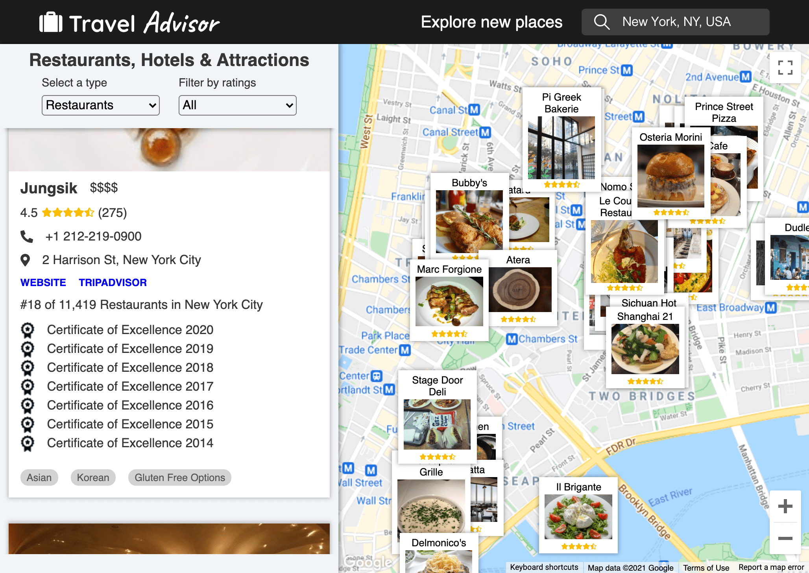

# Travel Advisor

[http://andrewpham.ca/travel-advisor](http://andrewpham.ca/travel-advisor)



## Features

- Look up restaurants, attractions, and hotels based on geolocation
- Filter results by ratings
- Interactive Google Map UI by [google-map-react](https://github.com/google-map-react/google-map-react)
- Autocomplete search input via google place api
- Auto update search results when moving around the map

## Built With

- React
- Styled components
- React hooks
- Powered by [Rapid API](https://rapidapi.com/)
- Powered by [Google maps API](https://developers.google.com/maps/documentation/javascript/overview)

To display the interactive map with the children elements I utilized `google-map-react`

```js
import React from 'react';
import GoogleMapReact from 'google-map-react';

const AnyReactComponent = ({ text }) => <div>{text}</div>;

export default function SimpleMap() {
  const defaultProps = {
    center: {
      lat: 10.99835602,
      lng: 77.01502627,
    },
    zoom: 11,
  };

  return (
    // Important! Always set the container height explicitly
    <div style={{ height: '100vh', width: '100%' }}>
      <GoogleMapReact
        bootstrapURLKeys={{ key: '' }}
        defaultCenter={defaultProps.center}
        defaultZoom={defaultProps.zoom}
      >
        <AnyReactComponent lat={59.955413} lng={30.337844} text="My Marker" />
      </GoogleMapReact>
    </div>
  );
}
```

- Everything inside the `<GoogleMapReact></GoogleMapReact>` Will be rendered on the map as a child as long as it has a latitude and longitude prop.

## Things to improve

If I had more time I would:

- Consume more APIs to show more data such as flights or weather.
- Change map styles to make UI more clean.
- Create custom hooks for cleaner code and reusability.
- Increase responsiveness with better CSS rules.
- Create UI for caught errors instead of just console logging them

## Folder Structure

```sh
travel-advisr/src/
├── components      # UI functional components
├── GlobalStyles    # Housing all the global styles
├── API.js          # API calls for RAPIDAPI
├── App.js          # Main app component
```

## Scripts

To run the development server first download or clone the repository then run these commands:

```sh
npm install
npm start
```
